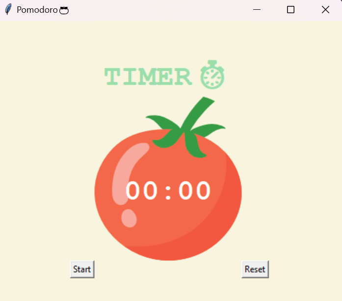

# Pomodoro Timer

This Python script implements a simple Pomodoro Timer using the `tkinter` library. The application helps you manage your work and break periods effectively using the Pomodoro Technique.

## Features

- Timer for work sessions and breaks
- Short breaks of 5 minutes after every 25-minute work session
- Long breaks of 20 minutes after every four work sessions
- Visual indicators for work, short breaks, and long breaks
- Progress tracking with checkmarks for completed sessions

## Requirements

- Python 3.x
- `tkinter` library (included with Python's standard library)

## Configuration

No additional configuration is required for this script. Simply run the script to start the Pomodoro Timer.

## Usage

- **Start the Timer**: Click the "Start" button to begin a work session.
- **Reset the Timer**: Click the "Reset" button to stop and reset the timer.
- **Visual Indicators**: The timer will display the remaining time and update the status for work, short breaks, and long breaks.

## Screenshots

##### Worked on this as part of a module project from Dr. Angela Yu's course on Udemy titled: 100 Days of Code: The Complete Python Pro Bootcamp

